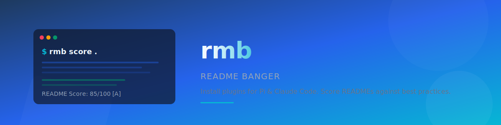

<p align="center">
  <picture>
    <source media="(prefers-color-scheme: dark)" srcset="assets/header.svg">
    
  </picture>
</p>

<p align="center">
  <a href="https://github.com/kwhatcher/banger-readme/actions"></a>
  <a href="https://crates.io/crates/rmb"></a>
  <a href="LICENSE"></a>
</p>

**rmb** is a CLI tool that installs plugins for the [Pi coding harness](https://github.com/earendil-works/pi) and [Claude Code](https://docs.anthropic.com/en/docs/claude-code), and scores READMEs against research-backed best practices.

## 📋 Table of Contents

- [Features](#-features)
- [Quick Start](#-quick-start)
- [Why rmb?](#-why-rmb)
- [README Scoring](#-readme-scoring)
- [Plugin Installer](#-plugin-installer)
- [Usage](#-usage)
- [Documentation](#-documentation)
- [Installation](#-installation)
- [Contributing](#-contributing)
- [License](#-license)
- [Acknowledgements](#-acknowledgements)

## 🎯 Why rmb?

Most open source READMEs are mediocre. Research shows that a great README can **5× your star conversion rate** — but most projects never invest the time. `rmb` solves two problems:

1. **Plugin management across tools** — Pi and Claude Code use different plugin directories and formats. `rmb` unifies installation, listing, and removal in one command.
2. **README quality measurement** — There's no objective way to know if your README is good. `rmb score` gives you a deterministic, research-backed score with specific, ranked recommendations.

Both features work without any AI or API calls — everything runs locally in milliseconds.

## ✨ Features

- **📦 Plugin installer** — Clone and install plugins from any git URL to Pi and Claude Code in one command
- **🔍 Auto-detection** — Detects whether a repo is a Pi skill, Claude Code plugin, or both
- **📊 README scoring** — Scores any README against 50+ criteria across 5 categories — no LLM required
- **🎯 Actionable feedback** — Every failed check comes with a specific, ranked recommendation
- **📋 List & remove** — See what's installed and cleanly uninstall from either or both targets

## 🚀 Quick Start

```bash
# Install
cargo install --git https://github.com/kwhatcher/banger-readme

# Score a README
rmb score .

# Install a plugin
rmb install https://github.com/user/my-plugin
```

## 📊 README Scoring

`rmb score` evaluates READMEs against 50+ deterministic criteria — no AI, no API calls, instant results.

```
╔══════════════════════════════════════════════════╗
║         README Score: 85/100  [A]               ║
║         "Excellent — well above average"         ║
║         Top 5% of open source READMEs            ║
╚══════════════════════════════════════════════════╝

┌─ Content Completeness ────── 32/35 ─────┐
│ ✅ Logo/Banner    ✅ Badges    ✅ One-liner  │
│ ✅ Demo           ✅ Features  ✅ Quick Start│
│ ✅ TOC            ✅ Why       ✅ Install    │
│ ✅ Usage          ✅ API Ref   ✅ Contrib    │
│ ✅ License        ✅ Acknowledgements       │
└──────────────────────────────────────────┘
```

**Five scoring categories:**

| Category | Weight | What It Checks |
|----------|--------|----------------|
| Content Completeness | 35 pts | 14 essential sections from logo to acknowledgements |
| Visual Design | 25 pts | Logo, badges, emojis, images, collapsible sections, dark/light mode |
| Project Hygiene | 20 pts | LICENSE, CONTRIBUTING.md, CODE_OF_CONDUCT.md, SECURITY.md, CI, tests |
| Cognitive Funneling | 15 pts | Section ordering: broad→specific, one-liner before install, license at bottom |
| Anti-Patterns | −15 pts | Deductions for placeholders, duplicate titles, badge abuse, wall of text |

## 📦 Plugin Installer

### Install

```bash
# Install to both Pi and Claude Code (default)
rmb install https://github.com/user/my-plugin

# Install a specific branch
rmb install https://github.com/user/my-plugin --branch main

# Only install for Pi
rmb install https://github.com/user/my-plugin --pi-only

# Only install for Claude Code
rmb install https://github.com/user/my-plugin --claude-only
```

### List

```bash
rmb list           # All plugins
rmb list --pi      # Pi skills only
rmb list --claude  # Claude Code plugins only
```

### Remove

```bash
rmb remove my-plugin           # From both
rmb remove my-plugin --pi      # From Pi only
rmb remove my-plugin --claude  # From Claude Code only
```

### How Detection Works

| File found | Plugin type |
|---|---|
| `SKILL.md` | Pi skill → installs to `~/.pi/agent/skills/<name>/` |
| `.claude-plugin.json` or `plugin.json` | Claude Code plugin → installs to `~/.claude/plugins/cache/` |
| Both | Installs to both targets |

## 📖 Usage

<details>
<summary><b>🔍 Scoring a README</b></summary>

```bash
# Score the README in the current directory
rmb score .

# Score a remote README
rmb score https://raw.githubusercontent.com/user/repo/main/README.md --no-hygiene

# Machine-readable JSON output
rmb score . --json

# CI mode: fail if score below threshold
rmb score . --check --threshold 70
```

</details>

<details>
<summary><b>📦 Managing plugins</b></summary>

```bash
# Install a plugin to both Pi and Claude Code
rmb install https://github.com/user/my-plugin

# List all installed plugins
rmb list

# Remove a plugin
rmb remove my-plugin
```

</details>

## 📖 Documentation

| Document | Description |
|----------|-------------|
| [Scoring Engine Design](docs/scoring-engine-design.md) | Full architecture and detection rules for `rmb score` |
| [README Best Practices Research](docs/readme-best-practices-research.md) | Index of all research on what makes a great README |
| [Why READMEs Matter](docs/why-readmes-matter.md) | The data, psychology, and philosophy |
| [Anatomy of a README](docs/anatomy-of-a-readme.md) | The 14-section structure in detail |
| [Project Hygiene](docs/project-hygiene.md) | License, contributing, CoC, security, tests |
| [Aesthetics & Visual Design](docs/aesthetics-and-visual-design.md) | Formatting, visual elements, linkification |
| [Emerging Patterns](docs/emerging-patterns.md) | Trends for 2024–2026 |
| [Anti-Patterns](docs/anti-patterns.md) | What repels users and common mistakes |
| [Exemplary READMEs](docs/exemplary-readmes.md) | Curated examples by category |
| [Examples Audit](docs/examples-audit.md) | How 31 production READMEs rank against criteria |

## 🛠️ Installation

### From Source

```bash
git clone https://github.com/kwhatcher/banger-readme
cd banger-readme
cargo build --release
```

The binary will be at `target/release/rmb`.

### Via Cargo

```bash
cargo install --git https://github.com/kwhatcher/banger-readme
```

### Running Tests

```bash
cargo test
cargo clippy -- -D warnings
cargo fmt -- --check
```

## 💬 Getting Help

- **Questions?** Open a [GitHub Discussion](https://github.com/kwhatcher/banger-readme/discussions)
- **Bug?** File an [issue](https://github.com/kwhatcher/banger-readme/issues)
- **Security issue?** See [SECURITY.md](SECURITY.md)

## 🤝 Contributing

We welcome contributions! See [CONTRIBUTING.md](CONTRIBUTING.md) for development setup, project structure, code standards, and the pull request process.

<a href="https://github.com/kwhatcher/banger-readme/graphs/contributors">
  
</a>

## 📄 License

MIT — see [LICENSE](LICENSE) for details.

## 🙏 Acknowledgements

Built with research from:

- [Awesome README](https://github.com/matiassingers/awesome-readme) — 21.2k stars, curated list of 100+ exemplary READMEs
- [Art of README](https://github.com/hackergrrl/art-of-readme) — Foundational essay on README psychology
- [Readme Driven Development](https://tom.preston-werner.com/2010/08/23/readme-driven-development.html) — Tom Preston-Werner
- [Daytona's 4,000-star launch guide](https://www.daytona.io/dotfiles/how-to-write-4000-stars-github-readme-for-your-project)
- [Elegant READMEs](https://www.yegor256.com/2019/04/23/elegant-readme.html) — Yegor Bugayenko
