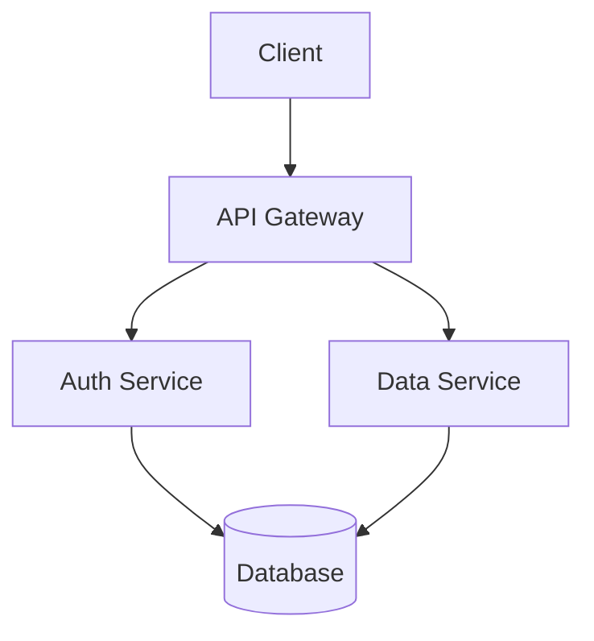

# Aesthetics & Visual Design

> Formatting as craft, visual elements that work, and the art of making your README beautiful.

---

## Formatting as Craft

Treat your README as a piece of source code. Make it properly and elegantly formatted. The visual presentation of your README is a direct reflection of the quality of your software — if the README looks sloppy, what does that say about the code?

### The Rules of README Typography

**1. Line width: 80 characters**

Only in very specific cases (badges, long links) are you allowed to make lines longer than 80 characters. Treat your README as source code — proper formatting makes it more readable and more professional.

([Elegant READMEs](https://www.yegor256.com/2019/04/23/elegant-readme.html))

**2. No indentation**

Always start text lines from the far left position, whether it's a paragraph or a section header. Markdown is not code — indentation in Markdown can trigger unintended formatting (like code blocks).

([Elegant READMEs](https://www.yegor256.com/2019/04/23/elegant-readme.html))

**3. Single empty lines between blocks**

Separate text blocks with a single empty line — never double-space. Double-spacing is a code smell that suggests the writer doesn't understand Markdown's block separation rules.

([Elegant READMEs](https://www.yegor256.com/2019/04/23/elegant-readme.html))

**4. Two or three levels of headers**

Use `##` (second level) for major sections and `###` (third level) for subsections. The fourth level (`####`) is "absolutely prohibited" — if you need that much nesting, your README is too long or poorly organized.

([Elegant READMEs](https://www.yegor256.com/2019/04/23/elegant-readme.html))

**5. Use emphasis strategically**

Use bold (`**text**`) to call out important words and key concepts. Use italics (`*text*`) sparingly for emphasis within sentences. Don't overuse either — if everything is emphasized, nothing is.

([thoughtbot](https://thoughtbot.com/blog/how-to-write-a-great-readme))

**6. Don't repeat the repo name as a title**

The title is already in the URL of your repo and the description is in the GitHub subtitle. Starting your README with `# MyProject` is redundant. Start with a logo instead.

([Elegant READMEs](https://www.yegor256.com/2019/04/23/elegant-readme.html))

---

## Visual Elements That Work

Based on analysis of 100+ exemplary READMEs in the [Awesome README](https://github.com/matiassingers/awesome-readme) list, these are the visual elements that consistently appear in the best READMEs:

### Project Logo

**Impact:** Brand identity, professionalism, memorability

**Examples:**
- [gofiber/fiber](https://github.com/gofiber/fiber#readme) — clean, modern logo centered at top
- [httpie/httpie](https://github.com/httpie/httpie#readme) — distinctive logo with project name
- [doomemacs/doomemacs](https://github.com/doomemacs/doomemacs#readme) — centered title with demon mascot

**How to do it:**
```markdown
<p align="center">
  
</p>
```

### Animated Demo GIF

**Impact:** Shows functionality instantly, proves the project works

**Examples:**
- [sourcerer-io/sourcerer-app](https://github.com/sourcerer-io/sourcerer-app#readme) — clean animated screenshot
- [alichtman/shallow-backup](https://github.com/alichtman/shallow-backup#readme) — terminal recording showing full workflow
- [skydio/revup](https://github.com/Skydio/revup#readme) — animated GIF demo + GIFs for each tutorial stage

**How to do it:**
```markdown
<p align="center">
  
</p>
```

### Screenshots

**Impact:** Proof of UI quality, shows what the user will see

**Examples:**
- [gitpoint/git-point](https://github.com/gitpoint/git-point#readme) — clean screenshots of mobile app
- [PostHog/posthog](https://github.com/PostHog/posthog#readme) — product screenshots with custom section icons
- [thelounge/thelounge](https://github.com/thelounge/thelounge#readme) — screenshot showing the web IRC client

**How to do it:**
```markdown
## Screenshots

| Light Mode | Dark Mode |
|------------|-----------|
|  |  |
```

### Architecture Diagrams

**Impact:** Understanding at a glance, shows technical sophistication

**Examples:**
- [AntonioFalcaoJr/EventualShop](https://github.com/AntonioFalcaoJr/EventualShop#readme) — detailed architecture diagrams
- [dutrevis/spark-resources-metrics-plugin](https://github.com/dutrevis/spark-resources-metrics-plugin#readme) — interactive Mermaid diagram
- [CoffeeIsAllYouNeed/Invisible-Driver](https://github.com/CoffeeIsAllYouNeed/Invisible-Driver#readme) — hardware and software diagrams

**How to do it with Mermaid (GitHub natively renders this):**
````markdown

````

### Custom Section Icons & Emojis

**Impact:** Visual navigation, personality, scannability

**Examples:**
- [chroline/well_app](https://github.com/chroline/well_app#readme) — yellow emojis in every section title
- [stevenfoncken/multitool-for-spotify-php](https://github.com/stevenfoncken/multitool-for-spotify-php#readme) — emojis in headlines
- [PostHog/posthog](https://github.com/PostHog/posthog#readme) — custom-made section icons

**How to do it:**
```markdown
## 🚀 Features
## 📦 Installation
## 🔧 Configuration
## 🤝 Contributing
## 📄 License
```

**Emoji reference for README sections:**

| Section | Emoji Options |
|---------|--------------|
| Features | 🚀 ✨ ⚡ 🔥 |
| Installation | 📦 💾 ⬇️ 🔧 |
| Usage | 💻 🎮 🛠️ 📝 |
| Configuration | ⚙️ 🔧 🎛️ |
| Documentation | 📚 📖 📝 |
| Contributing | 🤝 👥 🌟 💪 |
| License | 📄 ⚖️ 📜 |
| Support | 💬 ❓ 🆘 |
| Acknowledgments | 🙏 💖 ⭐ |

### Collapsible Sections

**Impact:** Keeps long content manageable, lets readers choose their depth

**Examples:**
- [gofiber/fiber](https://github.com/gofiber/fiber#readme) — collapsible code examples
- [MananTank/radioactive-state](https://github.com/MananTank/radioactive-state#readme) — collapsible sections for detailed content
- [dutrevis/spark-resources-metrics-plugin](https://github.com/dutrevis/spark-resources-metrics-plugin#readme) — expandable blocks for different installation scenarios

**How to do it:**
```markdown
<details>
<summary><b>📋 Advanced Configuration</b></summary>

Long content that would otherwise clutter the README...

</details>
```

### Benchmark Charts & Performance Data

**Impact:** Performance credibility, data-driven trust

**Examples:**
- [gofiber/fiber](https://github.com/gofiber/fiber#readme) — benchmark charts comparing to other frameworks

**How to do it:**
```markdown
## Benchmarks

| Framework | Requests/sec | Latency (ms) | Transfer/sec |
|-----------|-------------|--------------|--------------|
| Fiber | 125,000 | 0.8 | 18.5 MB |
| Express | 38,000 | 2.6 | 5.2 MB |
| Koa | 42,000 | 2.4 | 5.8 MB |
```

### Star Growth & Social Proof

**Impact:** Social proof, momentum signal

**Examples:**
- [gofiber/fiber](https://github.com/gofiber/fiber#readme) — star growth statistics
- [brenocq/implot3d](https://github.com/brenocq/implot3d#readme) — star history chart

**How to do it with star-history.com:**
```markdown
[](https://star-history.com/#user/repo&Date)
```

### Contributor Avatars

**Impact:** Human connection, community signal

**Examples:**
- [amplication/amplication](https://github.com/amplication/amplication#readme) — list of contributors with pictures and usernames
- [PostHog/posthog](https://github.com/PostHog/posthog#readme) — profile images for contributors

**How to do it:**
```markdown
## Contributors

<a href="https://github.com/user/repo/graphs/contributors">
  
</a>
```

This uses [contrib.rocks](https://contrib.rocks/) to auto-generate contributor images.

---

## The Power of Linkification

Aggressively linkify! If you talk about other modules, ideas, or people, make that reference text a link. Few modules exist in a vacuum — all work comes from other work. Help users follow your project's history and inspiration.

([Art of README](https://github.com/hackergrrl/art-of-readme#bonus-other-good-practices))

### What to Linkify

- **Other projects and libraries** — link to their repos
- **Technical concepts** — link to Wikipedia, MDN, or official docs
- **Unfamiliar terms** — link to Wiktionary, even Urban Dictionary for slang
- **People and contributors** — link to their GitHub profiles or Twitter
- **Blog posts and articles** — link to the original source
- **Cultural references** — make them links for the curious

### Link Hygiene

- **Don't rely on externally hosted images for critical information.** Your README will outlive your repository host and any of the things you hyperlink to — especially images. Inline anything essential. ([Art of README](https://github.com/hackergrrl/art-of-readme#bonus-other-good-practices))
- **Use footnotes for repeated references.** In Markdown you can keep footnotes at the bottom of your document, making repeated references cheap. ([Art of README](https://github.com/hackergrrl/art-of-readme#bonus-other-good-practices))
- **Check links regularly.** Broken links erode trust. Use a link checker in CI.

---

## HTML in Markdown: When and How

GitHub's Markdown renderer allows a subset of HTML. Used judiciously, HTML can enhance your README's visual design.

### Useful HTML Patterns

**Centered content:**
```markdown
<p align="center">
  
</p>

<p align="center">
  <a href="https://npmjs.com/package/name"></a>
</p>
```

**Image sizing:**
```markdown

```

**Custom alignment in tables:**
```markdown
| Left-aligned | Center-aligned | Right-aligned |
|:-------------|:--------------:|--------------:|
| Content | Content | Content |
```

### HTML to Avoid

- **Complex layouts** — they break on mobile and in non-GitHub renderers
- **JavaScript** — GitHub strips it for security
- **External CSS** — not supported
- **Iframes** — not supported

---

## Color in READMEs

GitHub's Markdown doesn't support custom colors directly, but there are workarounds:

### Using Badge Shields for Color

[shields.io](https://shields.io/) badges can be used creatively to add color-coded labels:

```markdown


```

### Using Images for Color

For more complex color needs, use SVG images:
```markdown

```

---

## Mobile Considerations

A significant portion of GitHub browsing happens on mobile devices. Your README should be readable on a phone screen.

### Mobile-Friendly Practices

- **Images should be responsive** — use `width="100%"` or reasonable max-widths
- **Code blocks should be short** — long lines in code blocks force horizontal scrolling
- **Tables should be narrow** — wide tables are painful on mobile
- **Avoid complex HTML layouts** — they rarely translate well to small screens
- **Test on mobile** — open your repo in a mobile browser and scroll through

---

## The Visual Hierarchy Checklist

- [ ] Logo at top, under 100px height
- [ ] Badges in logical groups, max 5 per line, same height per line
- [ ] Consistent header levels (## for sections, ### for subsections, no ####)
- [ ] 80-character line width (except badges and links)
- [ ] No indentation — all text starts at left margin
- [ ] Single empty lines between blocks
- [ ] Demo GIF or screenshot showing core functionality
- [ ] Code examples with syntax highlighting
- [ ] Emojis or icons for section headers (consistent style)
- [ ] Collapsible sections for long content
- [ ] Aggressive linkification of terms, projects, and people
- [ ] Mobile-friendly image sizes
- [ ] No broken links
- [ ] No externally hosted images for critical information

---

*Previous: [Project Hygiene](project-hygiene.md)*
*Next: [Emerging Patterns & Trends](emerging-patterns.md) — what's new in README design*
