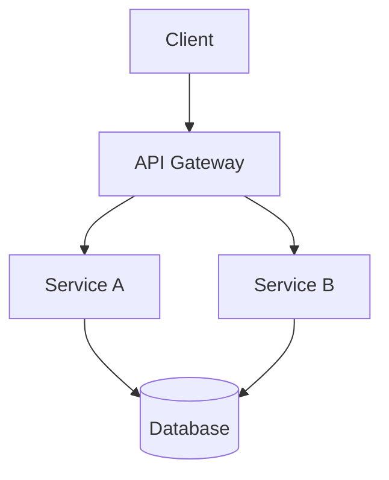
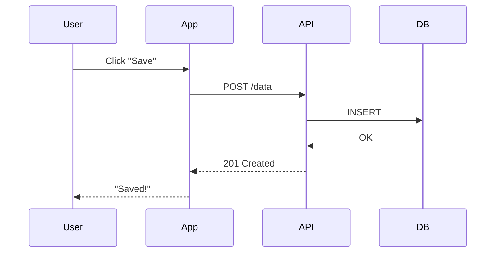

# Emerging Patterns & Trends (2024–2026)

> What's new, what's next, and what's working in README design — patterns observed across the most innovative open source projects.

---

## 1. Hero Animations as Mastheads

Projects are moving beyond static logos toward motion-rich first impressions. A centered hero animation at the very top of the README immediately signals that the project is modern, active, and polished.

**Notable examples:**
- [htmlhint/HTMLHint](https://github.com/htmlhint/HTMLHint#readme) — centered hero animation as the masthead, concise tagline, quick navigation links
- [gui-cs/Terminal.Gui](https://github.com/gui-cs/Terminal.Gui#readme) — hero animation followed by project logo, sample app demo GIF

**How to implement:**
```markdown
<p align="center">
  
</p>
```

**Why it works:** Motion captures attention in a way static images can't. A 2–3 second animation at the top of the page is the digital equivalent of a firm handshake — it establishes presence before a single word is read.

---

## 2. Auto-Generated READMEs from Structured Metadata

A new pattern emerging primarily in curated lists and data-heavy projects: READMEs that are generated programmatically from structured data sources.

**Notable example:**
- [yeaight7/awesome-ai-devtools](https://github.com/yeaight7/awesome-ai-devtools#readme) — auto-generated README built from structured metadata, with custom SVG header, comparison matrix, category index, tool tables, and review-backed summaries

**Why it works:** For projects that are essentially databases (curated lists, tool directories, resource collections), maintaining a README manually is error-prone and unsustainable. Auto-generation ensures consistency and makes the README a living document that updates with the data.

**Implementation approach:**
1. Store data in structured format (JSON, YAML, or a database)
2. Use a template engine to render the README
3. Run generation in CI on data changes
4. Auto-commit the updated README

---

## 3. Dynamic, Auto-Updating Content

Static READMEs are giving way to READMEs with living, breathing content that updates automatically.

### Dynamic Roadmaps

- [brenocq/implot3d](https://github.com/brenocq/implot3d#readme) — dynamic roadmap with auto-updating SVGs that reflect feature discussions in real-time, powered by GitHub Actions. Displays the 5 most recent discussions with clickable images for quick access.

### GitHub Stats Cards

- [anuraghazra/github-readme-stats](https://github.com/anuraghazra/github-readme-stats) — dynamically generated customizable GitHub cards for README: stats, extra pins, top languages, WakaTime. 20k+ stars.

```markdown
[](https://github.com/user/repo)
```

### Auto-Updating Contributor Recognition

- [sourcerer-io/hall-of-fame](https://github.com/sourcerer-io/hall-of-fame) — helps show recognition to repo contributors on README. Features new/trending/top contributors. Updates every hour.

### Star History Charts

- Multiple projects now embed star-history.com charts showing growth over time:
```markdown
[](https://star-history.com/#user/repo&Date)
```

**Why it works:** Dynamic content signals that the project is alive. A README that updates itself is a README that doesn't rot. It also provides social proof (star growth, active contributors) without manual maintenance.

---

## 4. Interactive & Collapsible Content

Using HTML `<details>` / `<summary>` tags to create collapsible sections that keep READMEs scannable while offering depth for those who want it.

**Notable examples:**
- [gofiber/fiber](https://github.com/gofiber/fiber#readme) — collapsible code examples with "show/hide" toggles
- [dutrevis/spark-resources-metrics-plugin](https://github.com/dutrevis/spark-resources-metrics-plugin#readme) — expandable blocks for different installation scenarios
- [MananTank/radioactive-state](https://github.com/MananTank/radioactive-state#readme) — collapsible sections for detailed API documentation

**Pattern:**
```markdown
<details>
<summary><b>📋 Click to expand: Advanced Configuration</b></summary>

Here's the detailed configuration guide that would otherwise
make the README too long to scan...

```yaml
# config.yml
option: value
```

</details>
```

**Why it works:** It solves the fundamental tension between "keep it concise" and "be comprehensive." The README stays scannable for quick evaluation while offering full depth for committed users. It respects both the 60-second scanner and the deep-dive reader.

---

## 5. Mermaid Diagrams Inline

GitHub natively renders [Mermaid](https://mermaid.js.org/) diagram syntax in Markdown. Projects are increasingly embedding architecture diagrams, flowcharts, and sequence diagrams directly in their READMEs.

**Notable example:**
- [dutrevis/spark-resources-metrics-plugin](https://github.com/dutrevis/spark-resources-metrics-plugin#readme) — interactive Mermaid diagram in the Developer section showcasing code architecture

**Common diagram types for READMEs:**

**Architecture overview:**
````markdown

````

**Data flow:**
````markdown

````

**Why it works:** Diagrams communicate structure in seconds that would take paragraphs of text. Mermaid diagrams are version-controlled (they're just text), render natively on GitHub, and can be edited by anyone. They're the sweet spot between "no diagram" (too vague) and "image file" (can't be edited, can't be diffed).

---

## 6. "Dogfooding" the README

Using the project itself to enhance its own README — demonstrating confidence and providing a live example of the project's capabilities.

**Notable example:**
- [Hexworks/Zircon](https://github.com/Hexworks/zircon#readme) — uses its own library to render elements in the README

**Variations:**
- A documentation generator that uses itself to generate its own README
- A charting library that renders its own benchmark charts
- A code formatter whose README code examples are formatted by the tool itself
- A linter whose README passes its own linting rules

**Why it works:** It's the ultimate credibility signal. If you won't use your own tool, why should anyone else? Dogfooding the README turns it into a living demo.

---

## 7. The Project Description Line as Conversion Tool

The one-line description under the repo name has emerged as the single most important piece of micro-copy in open source. It's the **only useful information** a visitor sees on GitHub Trending and Topics pages to decide whether to click.

**The anatomy of a great description line:**

```
[What it is] for [who it's for] that [key benefit]
```

**Examples:**
- ✅ "A Markdown WYSIWYG editor with chart & UML support" — clear, specific, feature-rich
- ✅ "Instant, scalable, secure development environments" — benefit-focused
- ❌ "A tool for developers" — too vague
- ❌ "The best Markdown editor ever made" — hype without substance
- ❌ "Markdown editor (WYSIWYG) with GFM standard support and chart/UML extensibility" — too long, gets truncated

**Character limit:** GitHub truncates descriptions at around 150 characters in most views. Keep it under 120 characters to be safe.

([TOAST UI, freeCodeCamp](https://www.freecodecamp.org/news/what-i-learned-from-an-old-github-project-that-won-3-000-stars-in-a-week-628349a5ee14/))

---

## 8. GitHub Topics Strategy

Topics have evolved from simple tags into a discovery engine. Choosing the right topics is now a strategic decision that affects long-term visibility.

**The strategy:**

1. **Use Featured Topics where possible.** GitHub maintains a list of [Featured Topics](https://github.com/topics) that get more visibility. Choose relevant ones from this list.

2. **Avoid hyper-competitive topics.** The `javascript` topic includes React, Vue, and freeCodeCamp — your project will never rank. Instead, choose niche topics:
   - Instead of `javascript` → `es6`, `nodejs`, `typescript`
   - Instead of `python` → `python3`, `asyncio`, `fastapi`
   - Instead of `machine-learning` → `nlp`, `computer-vision`, `pytorch`

3. **Mix broad and narrow topics.** One or two broad topics for discoverability, several narrow topics for ranking.

4. **Topics are not hashtags.** Don't add topics that aren't genuinely relevant. GitHub's algorithm and human curators both penalize topic spam.

**The TOAST UI Editor example:** They ranked 10th in the `markdown` topic with 5.4k stars — achievable with a focused strategy. If they had only used `javascript`, they'd be buried on page 50.

([TOAST UI, freeCodeCamp](https://www.freecodecamp.org/news/what-i-learned-from-an-old-github-project-that-won-3-000-stars-in-a-week-628349a5ee14/))

---

## 9. Video Trailers

A small but growing trend: project "trailers" — short videos (30–90 seconds) that introduce the project like a product launch.

**Notable example:**
- [Grigorij-Dudnik/Clean-Coder-AI](https://github.com/Grigorij-Dudnik/Clean-Coder-AI#readme) — project trailer video, beautiful logo, explanatory motion GIFs, framework schema diagram

**Why it works:** Video combines motion, sound, and narrative in a way that text and images can't. For projects with visual output (UIs, games, data visualization), a trailer can communicate the experience of using the tool better than any screenshot.

**Implementation:** Host the video on YouTube (or as a GIF for shorter demos) and embed it near the top of the README.

---

## 10. Multi-Language READMEs

Projects with international audiences are increasingly providing READMEs in multiple languages, either through:
- Separate `README-xx.md` files linked from the main README
- A language switcher at the top of the README

**Notable examples:**
- [gofiber/fiber](https://github.com/gofiber/fiber#readme) — language switcher badges at the top
- [gowebly/gowebly](https://github.com/gowebly/gowebly#readme) — language switcher links
- [Art of README](https://github.com/hackergrrl/art-of-readme) — translated into Chinese, Japanese, Brazilian Portuguese, Spanish, German, French, and Traditional Chinese

**Implementation:**
```markdown
[English](README.md) | [中文](README-zh.md) | [日本語](README-ja.md) | [Español](README-es.md)
```

---

## Trend Summary Table

| Trend | Maturity | Effort | Impact |
|-------|----------|--------|--------|
| Hero animations | Early adopter | Medium | High |
| Auto-generated READMEs | Emerging | High | High (for data-heavy projects) |
| Dynamic content (stats, roadmaps) | Mainstream | Low–Medium | Medium |
| Collapsible sections | Mainstream | Low | High |
| Mermaid diagrams | Mainstream | Low | High |
| Dogfooding | Niche | Varies | Very High |
| Optimized description line | Mainstream | Low | High |
| Strategic GitHub Topics | Mainstream | Low | Medium |
| Video trailers | Early adopter | High | High (for visual projects) |
| Multi-language READMEs | Growing | High (maintenance) | Medium |

---

*Previous: [Aesthetics & Visual Design](aesthetics-and-visual-design.md)*
*Next: [Anti-Patterns](anti-patterns.md) — what repels users and common mistakes to avoid*
